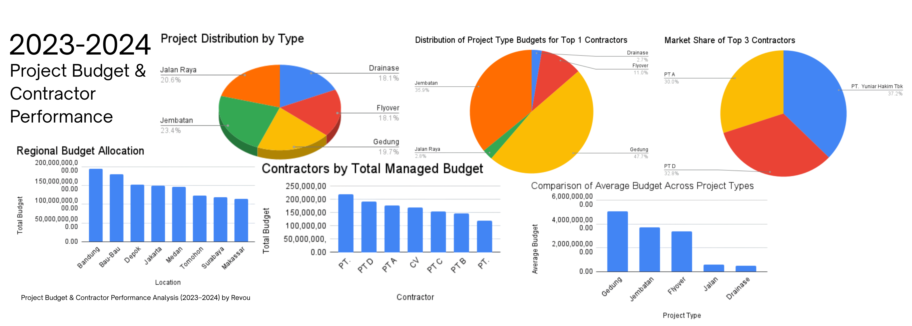

# Project Budget & Contractor Performance Analysis (2023–2024) by Revou
## Project Overview.
This project presents an end-to-end data analysis of project budget allocation and contractor performance during 2023–2024. The objective of this analysis is to understand      budget distribution patterns, identify dominant project categories, and evaluate contractor involvement. This project was completed         using SQL for data exploration and Microsoft Excel for dashboard visualization. All data are from Revou.
## Business Problem.
Organizations need clear insights into how project budgets are allocated and which contractors are responsible for execution. Without structured analysis, it is difficult to evaluate efficiency, detect concentration risks, or optimize future budget planning. Identify dominant project categories, analyze budget allocation patterns, evaluate contractor concentration, understand budget variability, and generate strategic business insights
## Tools & Technologies.
1. SQL (MySQL syntax)
2. Microsoft Excel (Pivot Table & Dashboard)
3. GitHub for documentation
## Project Structure
1. dataset/      → Raw dataset (CSV format)
2. sql/          → SQL queries used for analysis
3. dashboard/    → Excel dashboard & preview image
## Dataset Description
The dataset includes:
1. Project ID
2. Project Type
3. Contractor
4. Location
5. Project Name
## Data Cleaning
Using Excel for checked for missing values and deleted it, verified duplicate Project IDs, and ensured numeric consistency in the budget column
## Dashboard Preview

## Key Insights
The following insights were derived from aggregated SQL analysis and visual dashboard interpretation.

1️⃣ Operational Concentration in Bridge Projects

Bridge (Jembatan) projects account for the highest number of projects (102 projects), indicating strong operational focus in this category. However, despite dominating in frequency, bridge projects do not represent the highest average budget allocation. So, operational volume does not necessarily correlate with financial dominance.

2️⃣ Capital Intensity in Building Projects

Building (Gedung) projects have the highest average budget at IDR 5,086,256,423.21. This suggests that building projects require higher capital investment per project compared to other categories. So, building projects carry greater financial exposure and may require stricter cost monitoring.

3️⃣ Contractor Concentration Risk

PT. Yuniar Hakim Tbk manages the highest total budget, followed by PT A and PT D. The top three contractors control a significant share of total managed budget.

4️⃣ Regional Investment Focus

Bandung records the highest total regional budget allocation. This suggests that Bandung is a primary investment region within the project portfolio. So, geographical concentration may require regional risk assessment and balanced development strategy.

5️⃣ Strategic Specialization of PT Yuniar

Within PT Yuniar Hakim Tbk’s portfolio, the majority of budget allocation is concentrated in building projects. This indicates specialization in high-value construction segments. The company appears positioned as a key contractor in capital-intensive infrastructure development.
## Analytical Interpretation
1. Bridge development is the area with the highest project frequency.
2. Building projects receive the majority of the funding.
3. The distribution of the budget varies per category.
4. Concentration risk is indicated by contractor-level aggregation.
5. Geographic prioritization is demonstrated via regional allocation.
6. The portfolio exhibits diversity in terms of both financial size and operational scope.
## Strategic Implications
1. Diversification of contractor allocation may reduce dependency risk.
2. High-budget building projects require stricter financial monitoring.
3. Regional investment concentration may require risk assessment.
4. Portfolio balancing strategies could enhance long-term stability.
## Final Conclusion
This research demonstrates a structurally concentrated construction project portfolio in terms of operational and financial performance. While bridge projects account for the majority of projects (102), building projects have a greater capital intensity and the biggest average budget. This demonstrates that project frequency does not always correspond to financial magnitude. Contractor-level aggregation reveals a concentration trend, with PT. Yuniar Hakim Tbk and two other key contractors managing a sizable portion of the overall managed budget. This shows that there may be a risk of dependency and diminished diversification. Bandung receives the most total budget allocation, reflecting spatial investment precedence. Overall, the portfolio varies in terms of project size, financial dispersion, contractor dominance, and regional allocation. These findings highlight the need for balanced portfolio management, contractor diversification, and financial risk monitoring.
